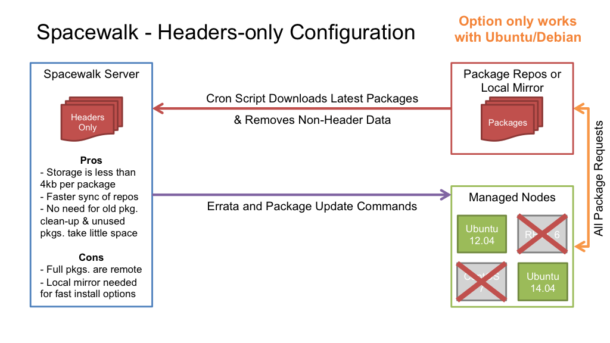

spacewalk-debian-headers-sync
=============================

An improvised repo-sync to bring Debian packages into Spacewalk that has been modified from <https://github.com/stevemeier/spacewalk-debian-sync> to import **header data from files only**. This does **not** import packages to Spacewalk that can be used for installation on machines.

## Background and Reasoning

Spacewalk copies all packages to itself for updating and package management, while this may work well with CentOS/RHEL and the like the less than full support for Debian/Ubuntu machines makes this approach not ideal.

There are many issues for storing all of the packages in Spacewalk:
* Disk space; no easy way to remove old pacakages
* `Packages.gz` offered by Spacewalk for Debian/Ubuntu packages are not formatted properly - need to run a script to fix the formatting so `apt-get` will work correctly when sourcing only from Spacewalk
* Spacewalk needs the metadata from the packages to manage them; unfortunately when syncing `universe` and `main` we do get a lot of packages like `libreoffice` and others that are multi GBs that in our server sytems we will never use  
* Again this goes back to the first issue of disk space and trying to filter out all of these packages do not make sense so another approach was taken.

## Headers Only Approach

Given the limitations for Debian/Ubuntu support on Spacewalk the best way I could come up with fixing the issues above was to store only the header information in Spacewalk. The reason to do this would allow us the flexibility to store all packages from `main` and `universe` as well as other repos using 2kb or less per package.

Additionally this method would mean that we would not need to worry about old package clean up or deal with the package management bugs in Spacewalk as they exist right now. This script has been modified to strip out the binary data from all packages and sync them with Spacewalk repositories.

### How It Works


## Running

Includeded is a script `spacewalk-sync.sh` that shows an example of how to import packages into `trusty` and `trusty-i386` channels and their sub-channels. Feel free to modify the file and run as a `cron` job to keep your Spacewalk instance in sync like I do.

## CAUTION - Client Update Needed

This will fix the Spacewalk side of things where errata, remote commands, updates, and other tasks will work with the headers but this does not fix the clients and how they retrieve packages. To update clients two files need to be modified on Debian/Ubuntu clients already registered with Spacewalk.

1. Modify `/etc/apt/apt.conf.d/50spacewalk` to the following:
```
#
# The configuration for apt-spacewalk
#

APT {
  Update {
        List-Refresh "true";
        Post-Invoke {            "if [ -x /usr/lib/apt-spacewalk/post_invoke.py ]; then /usr/lib/apt-spacewalk/post_invoke.py; fi";
        }
  }
};
DPkg::Post-Invoke {
    "/usr/lib/apt-spacewalk/post_invoke.py";
};
EOF
```
2. Remove `/etc/apt/sources.list.d/spacewalk.list` so `apt` no longer tries to contact Spacewalk for packages directly
3. Ensure `/etc/apt/sources.list` is populated with mirrors that can be reached to directly retrieve packages
4. Run `apt-get update` to test that packages can be found from the mirrors, at the end you should see
```
Apt-Spacewalk: Updating package profile
Reading package lists... Done
```
  * This indicates that the fix is working and that package updates are being relayed to Spacewalk as before

## More Info 

The completed solution I use will be available in a blog post with installation scripts to get started in the next month or so. I'll update this repo with links once available.
